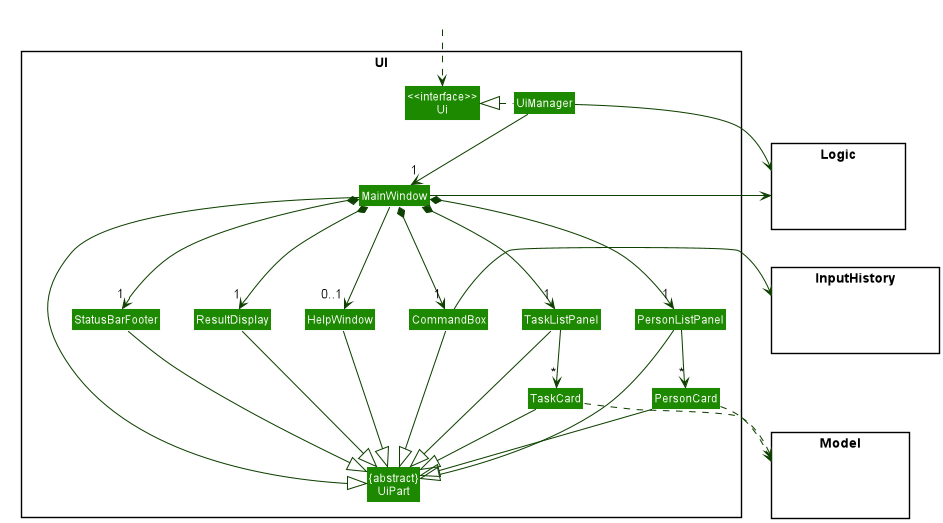
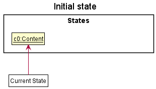
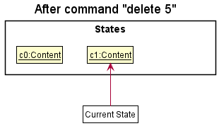
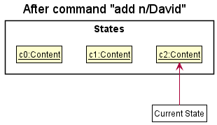
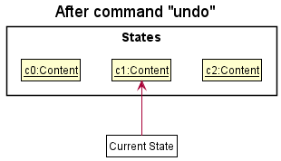
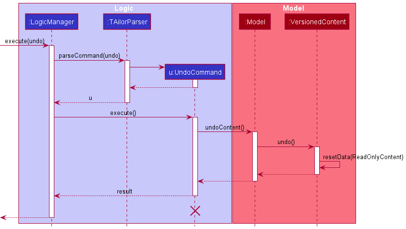
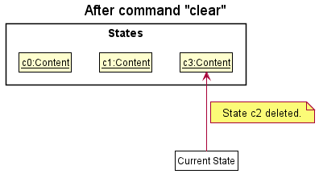

* Table of Contents
{:toc}

--------------------------------------------------------------------------------------------------------------------

## **Acknowledgements**

* {list here sources of all reused/adapted ideas, code, documentation, and third-party libraries -- include links to the original source as well}

--------------------------------------------------------------------------------------------------------------------

## **Setting up, getting started**

Refer to the guide [_Setting up and getting started_](SettingUp.md).

--------------------------------------------------------------------------------------------------------------------

## **Design**

<div markdown="span" class="alert alert-primary">

:bulb: **Tip:** The `.puml` files used to create diagrams in this document can be found in the [diagrams](https://github.com/se-edu/addressbook-level3/tree/master/docs/diagrams/) folder. Refer to the [_PlantUML Tutorial_ at se-edu/guides](https://se-education.org/guides/tutorials/plantUml.html) to learn how to create and edit diagrams.
</div>

### Architecture


The ***Architecture Diagram*** given above explains the high-level design of the App.

Given below is a quick overview of main components and how they interact with each other.

**Main components of the architecture**

**`Main`** has two classes called [`Main`](https://github.com/se-edu/addressbook-level3/tree/master/src/main/java/seedu/address/Main.java) and [`MainApp`](https://github.com/se-edu/addressbook-level3/tree/master/src/main/java/seedu/address/MainApp.java). It is responsible for,
* At app launch: Initializes the components in the correct sequence, and connects them up with each other.
* At shut down: Shuts down the components and invokes cleanup methods where necessary.

[**`Commons`**](#common-classes) represents a collection of classes used by multiple other components.

The rest of the App consists of four components.

* [**`UI`**](#ui-component): The UI of the App.
* [**`Logic`**](#logic-component): The command executor.
* [**`Model`**](#model-component): Holds the data of the App in memory.
* [**`Storage`**](#storage-component): Reads data from, and writes data to, the hard disk.


**How the architecture components interact with each other**

The *Sequence Diagram* below shows how the components interact with each other for the scenario where the user issues the command `delete 1`.


Each of the four main components (also shown in the diagram above),

* defines its *API* in an `interface` with the same name as the Component.
* implements its functionality using a concrete `{Component Name}Manager` class (which follows the corresponding API `interface` mentioned in the previous point.

For example, the `Logic` component defines its API in the `Logic.java` interface and implements its functionality using the `LogicManager.java` class which follows the `Logic` interface. Other components interact with a given component through its interface rather than the concrete class (reason: to prevent outside component's being coupled to the implementation of a component), as illustrated in the (partial) class diagram below.


The sections below give more details of each component.

### UI component

The **API** of this component is specified in [`Ui.java`](https://github.com/se-edu/addressbook-level3/tree/master/src/main/java/seedu/address/ui/Ui.java)



The UI consists of a `MainWindow` that is made up of parts e.g.`CommandBox`, `ResultDisplay`, `PersonListPanel`, `StatusBarFooter` etc. All these, including the `MainWindow`, inherit from the abstract `UiPart` class which captures the commonalities between classes that represent parts of the visible GUI.

The `UI` component uses the JavaFx UI framework. The layout of these UI parts are defined in matching `.fxml` files that are in the `src/main/resources/view` folder. For example, the layout of the [`MainWindow`](https://github.com/se-edu/addressbook-level3/tree/master/src/main/java/seedu/address/ui/MainWindow.java) is specified in [`MainWindow.fxml`](https://github.com/se-edu/addressbook-level3/tree/master/src/main/resources/view/MainWindow.fxml)

The `UI` component,

* executes user commands using the `Logic` component.
* listens for changes to `Model` data so that the UI can be updated with the modified data.
* keeps a reference to the `Logic` component, because the `UI` relies on the `Logic` to execute commands.
* depends on some classes in the `Model` component, as it displays `Person` object residing in the `Model`.

### Logic component

**API** : [`Logic.java`](https://github.com/se-edu/addressbook-level3/tree/master/src/main/java/seedu/address/logic/Logic.java)

Here's a (partial) class diagram of the `Logic` component:


How the `Logic` component works:
1. When `Logic` is called upon to execute a command, it uses the `AddressBookParser` class to parse the user command.
1. This results in a `Command` object (more precisely, an object of one of its subclasses e.g., `AddCommand`) which is executed by the `LogicManager`.
1. The command can communicate with the `Model` when it is executed (e.g. to add a person).
1. The result of the command execution is encapsulated as a `CommandResult` object which is returned from `Logic`.

The Sequence Diagram below illustrates the interactions within the `Logic` component for the `execute("delete 1")` API call.


<div markdown="span" class="alert alert-info">:information_source: **Note:** The lifeline for `DeleteCommandParser` should end at the destroy marker (X) but due to a limitation of PlantUML, the lifeline reaches the end of diagram.
</div>

Here are the other classes in `Logic` (omitted from the class diagram above) that are used for parsing a user command:


How the parsing works:
* When called upon to parse a user command, the `TailorParser` class creates an `XYZCommandParser` (`XYZ` is a placeholder for the specific command name e.g., `AddCommandParser`) which uses the other classes shown above to parse the user command and create a `XYZCommand` object (e.g., `AddCommand`) which the `TailorParser` returns back as a `Command` object.
* All `XYZCommandParser` classes (e.g., `AddCommandParser`, `DeleteCommandParser`, ...) inherit from the `Parser` interface so that they can be treated similarly where possible e.g, during testing.

### Model component
**API** : [`Model.java`](https://github.com/se-edu/addressbook-level3/tree/master/src/main/java/seedu/address/model/Model.java)


The `Model` component,

* stores the content data i.e., all `Person` and `Task` objects (which are contained in a `UniquePersonList` and `PriorityTaskList` object).
* stores the currently 'selected' `Person` objects (e.g., results of a search query) as a separate _filtered_ list which is exposed to outsiders as an unmodifiable `ObservableList<Person>` that can be 'observed' e.g. the UI can be bound to this list so that the UI automatically updates when the data in the list change.
* stores the task list data i.e., all `Task` objects (which are contained in a `PriorityTaskList` object).
* stores a `VersionedContentList` object that stores the previous states of content data (to support `undo`/`redo`)
* stores a `UserPref` object that represents the user’s preferences. This is exposed to the outside as a `ReadOnlyUserPref` objects.
* does not depend on any of the other three components (as the `Model` represents data entities of the domain, they should make sense on their own without depending on other components)

`VersionedContents` stores versions of the `Content` object, which in turn stores a `ContactList` and `PriorityTaskList` object. The class diagram for VersionedContents can be found below.


<div markdown="span" class="alert alert-info">:information_source: **Note:** An alternative (arguably, a more OOP) model is given below. It has a `Tag` list in the `AddressBook`, which `Person` references. This allows `AddressBook` to only require one `Tag` object per unique tag, instead of each `Person` needing their own `Tag` objects. This diagram is also truncated slightly as it does not show the Task classes.<br>


</div>


### Storage component

**API** : [`Storage.java`](https://github.com/se-edu/addressbook-level3/tree/master/src/main/java/seedu/address/storage/Storage.java)


The `Storage` component,
* can save contact list data, task list data and user preference data in json format, and read them back into corresponding objects.
* inherits from `ContactListStorage`, `TaskListStorage` and `UserPrefStorage`, which means it can be treated as either one (if only the functionality of only one is needed).
* depends on some classes in the `Model` component (because the `Storage` component's job is to save/retrieve objects that belong to the `Model`)

### Common classes

Classes used by multiple components are in the `seedu.addressbook.commons` package.

--------------------------------------------------------------------------------------------------------------------

## **Implementation**

This section describes some noteworthy details on how certain features are implemented.

### Task Manager feature

#### Implementation

This Task Manager feature is implemented with reference to how AddressBook/ContactList was implemented.
Below shows the important classes that were created:

Logic:
* NewTaskCommand (and its parser)
* RemoveTaskCommand (and its parser)

Model:
* DuplicateTaskException
* TaskNotFoundException
* Deadline
* Description
* Task (that uses Deadline and Description like how Person uses Name and Phone)
* ReadOnlyTaskList
* PriorityTaskList

Storage:
* JsonAdaptedTask
* JsonSerializableTaskList
* JsonTaskListStorage
* TaskListStorage

Most of these classes were linked to the respective XYZManager components in a similar way as ContactList.
For example, LogicManager now tries to save to the storage's contact list and task lists:

```
            storage.saveContactList(model.getContactList());
            storage.saveTaskList(model.getTaskList());
```

The following sequence diagram shows how the newTask operation works:


The current Task List uses a Priority Queue internally to sort/rank the tasks. Hence, the tasks
are prioritised according to the closeness to the deadline. Ie, a Task with a deadline of 1 March
will be in front of another Task with deadline of 1 December of the same year.

#### Design Considerations

**Aspect: Extendibility**

* Extendibility was heavily considered when implementing this feature. For Instance,
  * A ReadOnlyTaskList was done instead of just a single TaskList class, to allow for multiple versions of a Task List being
    used if desired. Ie perhaps a Task List that is sorted according to a new "Emergency" level instead of just date-time.
  * Deadline and Description classes were used instead of just a String and a LocalDateTime field to make the codebase more
    consistent with one another as seen from Person and its corresponding fields. This also would then allow a consolidated
    parsing and checking via the utilities.

**Aspect: Conformity**

* To allow the entire application to look like it has been coded by one person, the implementation of this task manager
  feature was implemented in a similar way as to how AddressBook/ContactList is implemented, along with its interactions
  with the XYZManagers.
  * An example would be to include a new `TaskListStorage` Interface for the `Storage` Interface to extend from. This
    hence provides the methods and an interface/facade for other parts of the code to perform task list operations on.
  * Another example would be how the Description and Deadlines for a `Task` are represented as individual classes instead
    of a String and a non-wrapped LocalDateTime, respectively. This is similar to how `Person` wraps the individual person
    attributes like Name and Phone. This also allows the Description and Deadline objects to be created separately and
    allow for finer control over the codebase.

### Undo/redo feature

#### Implementation

The undo/redo mechanism is facilitated by `VersionedContents`. It extends `Content` with an undo/redo history, stored internally as an `contentStateList` and `currentStatePointer`. Additionally, it implements the following operations:

* `VersionedContents#commit()` — Saves the current content state in its history.
* `VersionedContents#undo()` — Restores the previous content state from its history.
* `VersionedContents#redo()` — Restores a previously undone content state from its history.

These operations are exposed in the `Model` interface as `Model#commitContent()`, `Model#undoContent()` and `Model#redoContent()` respectively.

Given below is an example usage scenario and how the undo/redo mechanism behaves at each step.

Step 1. The user launches the application for the first time. The `VersionedContents` will be initialized with the initial content state, and the `currentStatePointer` pointing to that single content state.



Step 2. The user executes `delete 5` command to delete the 5th person in the contact list. The `delete` command calls `Model#commitContent()`, causing the modified state of the content after the `delete 5` command executes to be saved in the `contentStateList`, and the `currentStatePointer` is shifted to the newly inserted content state.



Step 3. The user executes `add n/David …​` to add a new person. The `add` command also calls `Model#commitContent()`, causing another modified content state to be saved into the `contentStateList`.



<div markdown="span" class="alert alert-info">:information_source: **Note:** If a command fails its execution, it will not call `Model#commitContent()`, so the content state will not be saved into the `contentStateList`.

</div>

Step 4. The user now decides that adding the person was a mistake, and decides to undo that action by executing the `undo` command. The `undo` command will call `Model#undoContent()`, which will shift the `currentStatePointer` once to the left, pointing it to the previous content state, and restores the content to that state.



<div markdown="span" class="alert alert-info">:information_source: **Note:** If the `currentStatePointer` is at index 0, pointing to the initial content state, then there are no previous content states to restore. The `undo` command uses `Model#canUndoContent()` to check if this is the case. If so, it will return an error to the user rather
than attempting to perform the undo.

</div>

The following sequence diagram shows how the undo operation works:



<div markdown="span" class="alert alert-info">:information_source: **Note:** The lifeline for `UndoCommand` should end at the destroy marker (X) but due to a limitation of PlantUML, the lifeline reaches the end of diagram.

</div>

The `redo` command does the opposite — it calls `Model#redoContent()`, which shifts the `currentStatePointer` once to the right, pointing to the previously undone state, and restores the content to that state.

<div markdown="span" class="alert alert-info">:information_source: **Note:** If the `currentStatePointer` is at index `contentStateList.size() - 1`, pointing to the latest contact list state, then there are no undone content states to restore. The `redo` command uses `Model#canRedoContent()` to check if this is the case. If so, it will return an error to the user rather than attempting to perform the redo.

</div>

Step 5. The user then decides to execute the command `list`. Commands that do not modify the content, such as `list`, will usually not call `Model#commitContent()`, `Model#undoContent()` or `Model#redoContent()`. Thus, the `contentStateList` remains unchanged.


Step 6. The user executes `clear`, which calls `Model#commitContent()`. Since the `currentStatePointer` is not pointing at the end of the `contentStateList`, all content states after the `currentStatePointer` will be purged. Reason: It no longer makes sense to redo the `add n/David …​` command. This is the behavior that most modern desktop applications follow.



The following activity diagram summarizes what happens when a user executes a new command:


#### Design considerations:

**Aspect: How undo & redo executes:**

* **Alternative 1 (current choice):** Saves the entire content.
  * Pros: Easy to implement.
  * Cons: May have performance issues in terms of memory usage.

* **Alternative 2:** Individual command knows how to undo/redo by
  itself.
  * Pros: Will use less memory (e.g. for `delete`, just save the person being deleted).
  * Cons: We must ensure that the implementation of each individual command are correct.


### Mailing feature

#### Implementation

This Mailing feature enables the user to initiate the system
default mail application (if present). In order to achieve this,
Java AWT (Abstract Window Toolkit) API is used.
Below shows the important classes that were created:

Logic:
* MailIndexCommand (and its parser)
* MailXCommand (and its parser)
* MailAllCommand

Commons:
* MailUtil

MailUtil class contains the interaction of TAior with the desktop. All the commands
call a method in this class to accomplish their respective functionalities.

The following sequence diagram shows how the `mail-index` operation works:


The following sequence diagram shows how the `mail-x` operation works:


The following sequence diagram shows how the `mail-all` operation works:


#### Design Considerations

**Aspect: Extendibility**


**Aspect: Conformity**


--------------------------------------------------------------------------------------------------------------------

## **Documentation, logging, testing, configuration, dev-ops**

* [Documentation guide](Documentation.md)
* [Testing guide](Testing.md)
* [Logging guide](Logging.md)
* [Configuration guide](Configuration.md)
* [DevOps guide](DevOps.md)

--------------------------------------------------------------------------------------------------------------------

## **Appendix: Requirements**

### Product scope

**Target user profile**:

* is a teaching assistant for a computing course
* has a need to manage a significant number of contacts
* prefer desktop apps over other types
* can type fast
* prefers typing to mouse interactions
* is reasonably comfortable using CLI apps

**Value proposition**: The app will help to facilitate a Teaching Assistant’s journey within a single module, particularly with some tedious administrative tasks.


### User stories

Priorities: High (must have), Medium (nice to have), Low (unlikely to have)

|Priority       |User                                                |Function                                                                                                           |Benefit                                                                                                    |
|---------------|----------------------------------------------------|-------------------------------------------------------------------------------------------------------------------|-----------------------------------------------------------------------------------------------------------|
|priority.High  |As a Teaching Assistant,                            |I am able to see my students’ contact details                                                                      |so that I can more easily communicate messages to them                                                     |
|priority.High  |As a Teaching Assistant,                            |I can send bulk emails to students to remind them of the deadlines or to make general PSAs                         |so that I don’t miss on passing them crucial information                                                   |
|priority.High  |As a Teaching Assistant,                            |I can know the number of students in each of my tutorial classes and their names                                   |This helps me keep track of attendance for each session                                                    |
|priority.High  |As a Teaching Assistant,                            |I can “tag” students with various tags                                                                             |so that I can keep track of who to follow up on, who to check up on more often etc                         |
|priority.High  |As a Teaching Assistant                             |I can manually add new students into my contact list                                                               |so I have alternate methods to add students other than to rely on exporting from a file                    |
|priority.High  |As a Teaching Assistant                             |I can edit my students’ contact details manually                                                                   |so that if they have any changes to their details, I can keep track of it and still be able to contact them|
|priority.High  |As a Teaching Assistant                             |I can delete students from my contact list                                                                         |so I can make changes to my student list                                                                   |
|priority.High  |As a new Teaching Assistant using this app          |I am able to get help on how to use the app                                                                        |so I can learn how to use this program                                                                     |
|priority.High  |As a Teaching Assistant who makes typos often       |I am able to go back to the mistyped command                                                                       |so I can quickly correct spelling errors made                                                              |
|priority.Medium|As a Teaching Assistant,                            |I can see the upcoming deadlines                                                                                   |so I prepare for it or remind students about it                                                            |
|priority.Medium|As a Teaching Assistant,                            |I can keep track of how my students have been performing                                                           |so that I can better help the students who need more help                                                  |
|priority.Medium|As a Teaching Assistant                             |I can see all the groups that I need to mark/supervise                                                             |so that I can track all my students and groups                                                             |
|priority.Medium|As a Teaching Assistant,                            |I can manage consultations with my students with the calender system                                               |so that I can more easily cross-reference my availability with my students                                 |
|priority.Medium|As a Teaching Assistant                             |I can know which student’s performance requires review and attention per assignment                                |so that I can reach out and offer help possibly in the form of a consultation.                             |
|priority.Medium|As a Teaching Assistant                             |I can group students under different tutorial classes                                                              |so I can personalize messages to individual classes                                                        |
|priority.Medium|As a Teaching Assistant,                            |I can receive anonymous feedback from my students                                                                  |so that I can help my students in a more effective way.                                                    |
|priority.Medium|As a Teaching Assistant                             |I can automatically remind students about deadlines and examinations                                               |so that my students will be reminded about the upcoming deadlines easily                                   |
|priority.Low   |As a Teaching Assistant,                            |I can export the necessary numbers about all students in my class from assignment marks to attendance to a CSV file|so that I can perform a better analysis of the semester on whole                                           |
|priority.Low   |As a Teaching Assistant,                            |I can track student's assignment progress                                                                          |so that I know which student to focus on and give reminders to                                             |
|priority.Low   |As a Teaching Assistant who uses different devices  |I can sync my data over different devices                                                                          |so I can use the app over diff devices                                                                     |
|priority.Low   |As a first time user                                |I can see sample data                                                                                              |so I can see how the app can be used                                                                       |
|priority.Low   |As a Teaching Assistant for a new class             |I can share an introduction document with my students                                                              |so that they can get to know each other a little bit more before the first session                         |
|priority.Low   |As a Tech-Savvy Teaching Assistant who uses Telegram|I can create a telegram group and invite all students to it                                                        |so I can communicate to my students using telegram                                                         |
|priority.Low   |As a Tech-Savvy Teaching Assistant who uses Discord |I can create a discord channel and invite all my students to it                                                    |so I can communicate to my students using discord                                                          |
|priority.Low   |As a Teaching Assistant using Coursemology          |I can receive notifications from Coursemology on the application                                                   |so I can quickly respond to my student’s questions and submissions on Coursemology                         |
|priority.Low   |As a Teaching Assistant who is involved in grading  |I can automatically distribute grades to students easily                                                           |so my students will not have to manually wait or check for the grades to be released                       |
|priority.Low   |As a Teaching Assistant who takes makeup tutorials  |I can add students temporarily to a class                                                                          |so that I can have the students in my mailing list temporarily                                             |
|priority.Low   |As a Teaching Assistant during unprecedented times  |I can instantly create Zoom meetings using the Zoom SDK                                                            |so that I can automate my workflow for sending meeting invitations to the group                            |
|priority.Low   |As a Teaching Assistant                             |I can tag students for plagarism                                                                                   |so I can automatically inform my professors about plagiarism cases                                         |
|priority.Low   |As a Teaching Assistant who is involved in grading  |I can see a graph of trends about my students’ performance individually                                            |so I can track the progress and improvement of my students                                                 |
|priority.Low   |As a Teaching Assistant                             |I can create aliases for websites that are commonly used by students                                               |so that my students and I can access commonly visited websites easily                                      |
|priority.Low   |As a Teaching Assistant teaching multiple modules   |I am able to separate the management of the modules                                                                |so that I can be more organised in my work and teaching                                                    |


### Use cases

(For all use cases below, the **System** is `TAilor` and the **Actor** is the `user`, unless specified otherwise)

**Use case 1 (UC1): Importing an existing database**

**MSS**

1. User requests to import an existing file
2. TAilor requests for the file location
3. User specifies the file location
4. TAilor uploads the file

    Use case ends.

**Extensions:**

* 4a. User requests to add more students manually (UC2)

    User case ends

**Use case 2 (UC2): Manually adding students**

**MSS**

1. User uses the 'add' command
2. TAilor updates the database with student details

   Use case ends.

**Extensions:**

* 1a. User adds permanent student to the class group
    * 1a1. User uses the permanent tag with student details
    * 1a2. TAilor adds the student contact details to the respective group's database

      Use case ends.


* 1b. User adds temporary student to the class group
    * 1b1. User uses the temporary tag with student details
    * 1b2. TAilor asks for validity of temporary tag
    * 1b3. User enters the lifespan of the entry
    * 1b4. TAilor adds the student contact details to the respective group's database

      Use case ends.


**Use case 3 (UC3): Finding a student**

**MSS**

1. User requests to find student through particular keywords
2. TAilor returns contact details of matching student

   Use case ends.

**Extensions:**

* 2a. TAilor doesn't find any matches
  * 2a1. TAilor displays an empty list

    User case ends

* 2b. TAilor finds more than one matching student
  * 2b1. TAilor returns list of matching students
  * 2b2. User enters index to select desired student

    User case ends

*{More to be added}*

### Non-Functional Requirements

1.  Should work on any _mainstream OS_ as long as it has Java `11` or above installed.
2.  Should be able to hold up to 1000 persons without a noticeable sluggishness in performance for typical usage.
3.  A user with above average typing speed for regular English text (i.e. not code, not system admin commands) should be able to accomplish most of the tasks faster using commands than using the mouse.
4. The code should be open source.
5. Should not require internet connection.

*{More to be added}*

### Glossary

* **Mainstream OS**: Windows, Linux, Unix, OS-X
* **Private contact detail**: A contact detail that is not meant to be shared with others
* **Tutor**: A tutor is a teaching assistant for a particular module in NUS.
* **Module**: The subject being taught by the tutor.
* **Group**: A group of students belonging to a particular module managed under a tutor.

--------------------------------------------------------------------------------------------------------------------

## **Appendix: Instructions for manual testing**

Given below are instructions to test the app manually.

<div markdown="span" class="alert alert-info">:information_source: **Note:** These instructions only provide a starting point for testers to work on;
testers are expected to do more *exploratory* testing.

</div>

### Launch and shutdown

1. Initial launch

   1. Download the jar file and copy into an empty folder

   1. Double-click the jar file Expected: Shows the GUI with a set of sample contacts. The window size may not be optimum.

1. Saving window preferences

   1. Resize the window to an optimum size. Move the window to a different location. Close the window.

   1. Re-launch the app by double-clicking the jar file.<br>
       Expected: The most recent window size and location is retained.

1. _{ more test cases …​ }_

### Deleting a person

1. Deleting a person while all persons are being shown

   1. Prerequisites: List all persons using the `list` command. Multiple persons in the list.

   1. Test case: `delete 1`<br>
      Expected: First contact is deleted from the list. Details of the deleted contact shown in the status message. Timestamp in the status bar is updated.

   1. Test case: `delete 0`<br>
      Expected: No person is deleted. Error details shown in the status message. Status bar remains the same.

   1. Other incorrect delete commands to try: `delete`, `delete x`, `...` (where x is larger than the list size)<br>
      Expected: Similar to previous.

1. _{ more test cases …​ }_

### Saving data

1. Dealing with missing/corrupted data files

   1. _{explain how to simulate a missing/corrupted file, and the expected behavior}_

1. _{ more test cases …​ }_
